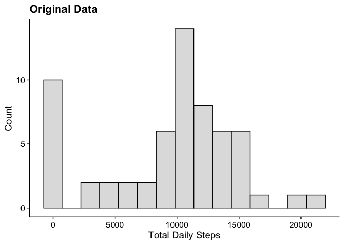
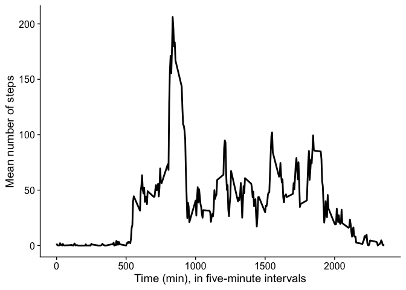
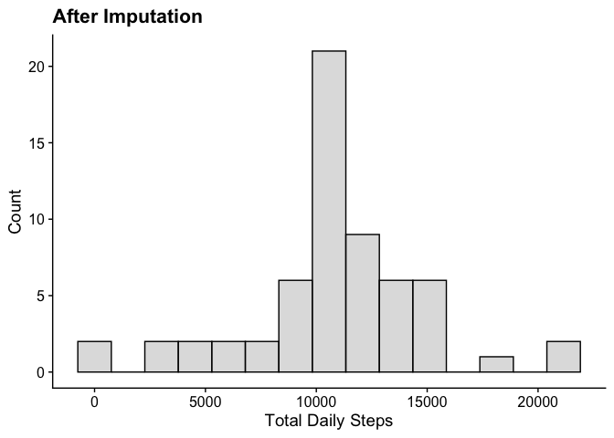
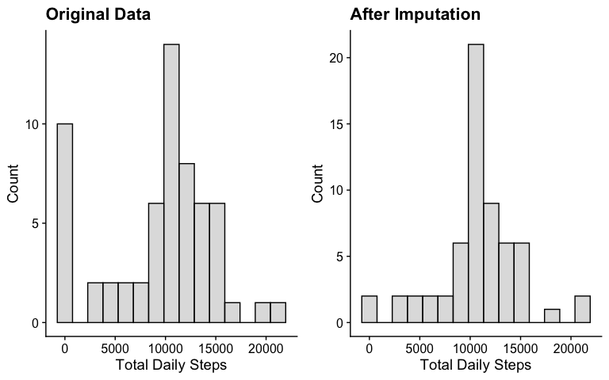
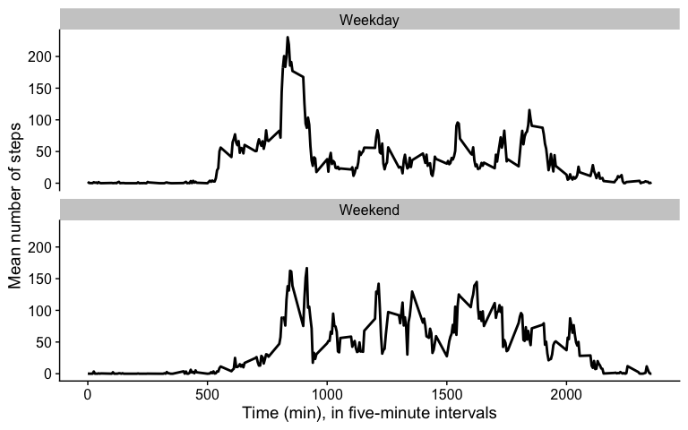

## Introduction

It is now possible to collect a large amount of data about personal movement using activity monitoring devices such as a Fitbit, Nike Fuelband, or Jawbone Up. These type of devices are part of the “quantified self” movement – a group of enthusiasts who take measurements about themselves regularly to improve their health, to find patterns in their behavior, or because they are tech geeks. But these data remain under-utilized both because the raw data are hard to obtain and there is a lack of statistical methods and software for processing and interpreting the data.

This assignment makes use of data from a personal activity monitoring device. This device collects data at 5 minute intervals through out the day. The data consists of two months of data from an anonymous individual collected during the months of October and November, 2012 and include the number of steps taken in 5 minute intervals each day.

The data for this assignment can be downloaded from the course web site [here](https://d396qusza40orc.cloudfront.net/repdata%2Fdata%2Factivity.zip). 

The variables included in this dataset are:

* __steps:__ Number of steps taking in a 5-minute interval (missing values are coded as NA)

* __date:__ The date on which the measurement was taken in YYYY-MM-DD format

* __interval:__ Identifier for the 5-minute interval in which measurement was taken

The dataset is stored in a comma-separated-value (CSV) file and there are a total of 17,568 observations in this dataset.

## Read in data set


```r
data <- fread("./data/activity.csv")
dim(data)
```

```
## [1] 17568     3
```

```r
summary(data)
```

```
##      steps             date               interval     
##  Min.   :  0.00   Min.   :2012-10-01   Min.   :   0.0  
##  1st Qu.:  0.00   1st Qu.:2012-10-16   1st Qu.: 588.8  
##  Median :  0.00   Median :2012-10-31   Median :1177.5  
##  Mean   : 37.38   Mean   :2012-10-31   Mean   :1177.5  
##  3rd Qu.: 12.00   3rd Qu.:2012-11-15   3rd Qu.:1766.2  
##  Max.   :806.00   Max.   :2012-11-30   Max.   :2355.0  
##  NA's   :2304
```

```r
head(data)
```

```
##    steps       date interval
## 1:    NA 2012-10-01        0
## 2:    NA 2012-10-01        5
## 3:    NA 2012-10-01       10
## 4:    NA 2012-10-01       15
## 5:    NA 2012-10-01       20
## 6:    NA 2012-10-01       25
```

## What is the mean total number of steps taken per day?

For this part of the assignment, you can ignore the missing values in the dataset.

Required output:

1. Calculate the total number of steps taken per day.
2. Make a histogram of the total number of steps taken each day.
3. Calculate and report the mean and median of the total number of steps taken per day.


```r
#Calculate the total number of steps taken per day
daily_total_steps <- data %>% 
  group_by(date) %>% 
  summarise(total_steps = sum(steps, na.rm=TRUE))

#make histogram for total number of steps taken each day
p1 <- ggplot(daily_total_steps, aes(x=total_steps)) +
  geom_histogram(alpha=0.5, color = 1, fill="grey", na.rm=TRUE, bins=15) +
  xlab("Total Daily Steps") +
  ylab("Count") +
  ggtitle("Original Data") +
  theme_cowplot()
p1
```

<!-- -->

```r
#calculate and report the mean and median total number of steps taken per day
#mean
mean_total <- round(mean(daily_total_steps$total_steps), digits = 0)
#median
median_total <- median(daily_total_steps$total_steps)
```

The mean total number of steps taken per day is 9354, and the median number of steps taken per day is 10395.

## What is the average daily activity pattern?

1. Make a time series plot for 5-minute interval on the x-axis and the average number of steps taken, averaged across all days (y-axis).
2. Which 5-minute interval, on averaged across all the days in the dataset, contains the maximum number of steps?


```r
#group by interval, calculate mean steps, plot geom_line

intervalMeans <- data %>% 
  group_by(interval) %>% 
  summarise(across(steps, list(mean = mean, sd = sd), na.rm=TRUE))

#make ggplot of mean steps by interval
ggplot(intervalMeans, aes(x=interval, y=steps_mean)) +
  geom_line(lwd=1) +
  xlab("Time (min), in five-minute intervals") +
  ylab("Mean number of steps") +
  theme_cowplot()
```

<!-- -->

```r
#which interval has highest mean number of steps across all days?
intervalMeans %>% 
  filter(steps_mean == max(steps_mean)) %>% 
  knitr::kable()
```


| interval| steps_mean| steps_sd|
|--------:|----------:|--------:|
|      835|   206.1698| 292.9958|

The interval with the highest average number of steps across all days is "835", which corresponds to 8:35-8:40 AM.

## Imputing missing values

Note that there are a number of days/intervals where there are missing values (coded as NA). The presence of missing days may introduce bias into some calculations or summaries of the data.

1. Calculate and report the total number of missing values in the dataset (i.e. the total number of rows with NAs).

2. Devise a strategy for filling in all of the missing values in the dataset. The strategy does not need to be sophisticated. For example, you could use the mean/median for that day, or the mean for that 5-minute interval, etc.

3. Create a new dataset that is equal to the original dataset but with the missing data filled in.

4. Make a histogram of the total number of steps taken each day and Calculate and report the mean and median total number of steps taken per day. Do these values differ from the estimates from the first part of the assignment? What is the impact of imputing missing data on the estimates of the total daily number of steps?


```r
#calculate number of rows with missing values in the dataset
#subset the data frame for any rows where the rowSum (number of rows with an NA) is not zero and return number of rows
nrow(data[rowSums(is.na(data)) > 0,])
```

```
## [1] 2304
```

```r
#replace any missing steps values with the mean of that interval across all days
data_imputed <- data %>%
  group_by(interval) %>% 
  mutate(steps = replace(steps, is.na(steps), mean(steps, na.rm=TRUE)))

#make dataset for total steps per day from imputed dataset
daily_total_imp <- data_imputed %>% 
  group_by(date) %>% 
  summarise(total_steps = sum(steps, na.rm=TRUE))

#make histogram for total number of steps taken each day after imputation
p2 <- ggplot(daily_total_imp, aes(x=total_steps)) +
  geom_histogram(alpha=0.5, color = 1, fill="grey", na.rm=TRUE, bins=15) +
  xlab("Total Daily Steps") +
  ylab("Count") +
  ggtitle("After Imputation") +
  theme_cowplot()
p2
```

<!-- -->

```r
#calculate and report the mean and median total number of steps taken per day
#mean
mean_total_imp <- round(mean(daily_total_imp$total_steps), digits = 2)
#median
median_total_imp <- round(median(daily_total_imp$total_steps), digits=2)
```

After imputation, the mean total number of steps taken per day is 10766.19, and the median number of steps taken per day is 10766.19. The mean is increased roughly 10%, and the median is increased by roughly 3-4% as compared to data without imputation.

Plot original and imputed side-by-side to compare:

```r
plot_grid(p1, p2)
```

<!-- -->

## Are there differences in activity patterns between weekdays and weekends?

For this part the `weekdays()` function may be of some help here. Use the dataset with the filled-in missing values for this part.

Create a new factor variable in the dataset with two levels – “weekday” and “weekend” indicating whether a given date is a weekday or weekend day.

Make a panel plot containing a time series plot (i.e. type = "l") of the 5-minute interval (x-axis) and the average number of steps taken, averaged across all weekday days or weekend days (y-axis). See the README file in the GitHub repository to see an example of what this plot should look like using simulated data.


```r
#get day of the week from date column; add group ID for weekend or weekday
data_imputed_dates <- data_imputed %>% 
  mutate(Weekday = weekdays(date),
         Group = ifelse(Weekday == "Saturday"| Weekday == "Sunday", "Weekend", "Weekday")) %>% 
  group_by(Group, interval) %>% 
  summarise(across(steps, mean, na.rm=TRUE))

p3 <- ggplot(data_imputed_dates, aes(x=interval, y=steps)) +
  geom_path(lwd=1) +
  facet_wrap(vars(Group), dir = "v") +
  xlab("Time (min), in five-minute intervals") +
  ylab("Mean number of steps") +
  theme_cowplot()
p3
```

<!-- -->

Here we see a clear difference, where the activity (measured by steps) begins later in the morning on the weekend than on the weekdays.
